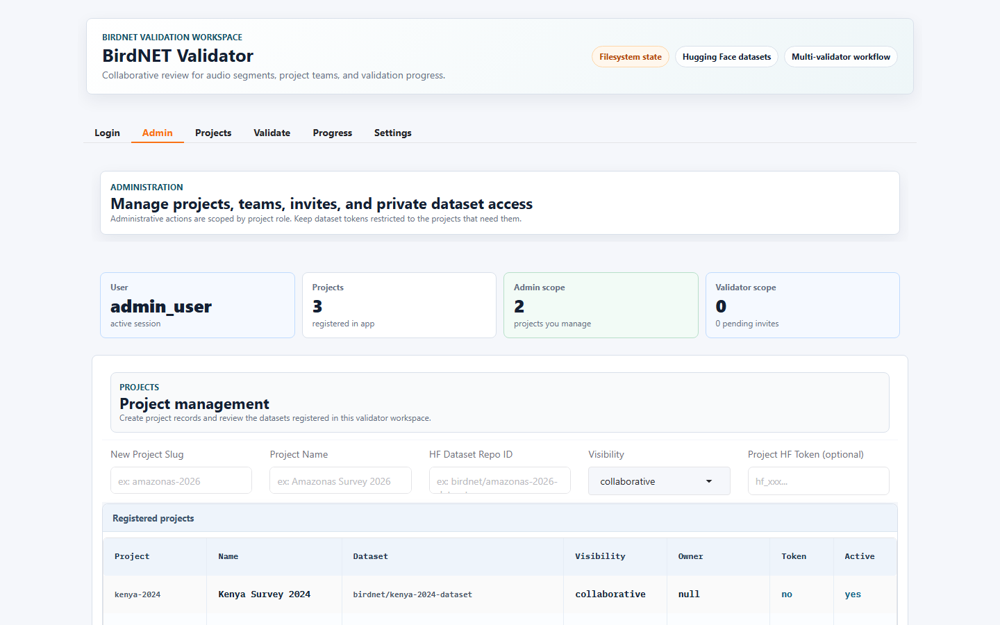
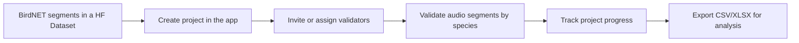
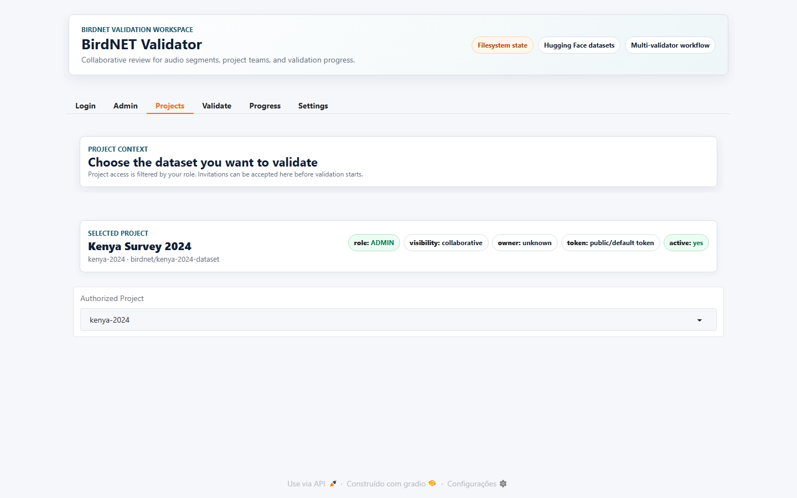
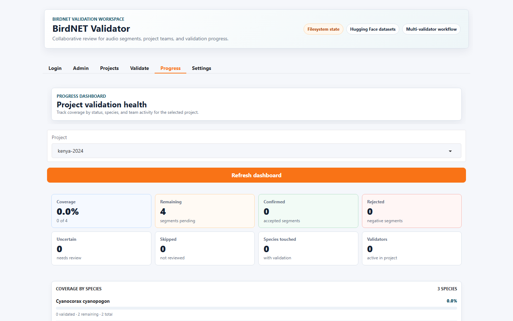
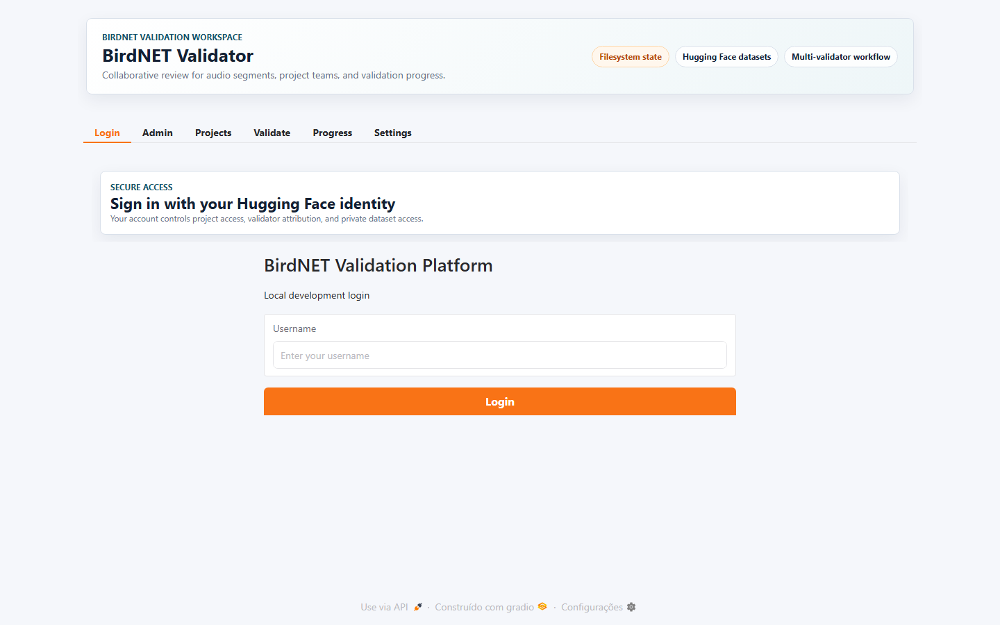

# BirdNET Validator

Professional collaborative validation for BirdNET audio segments hosted in
Hugging Face datasets.

BirdNET Validator helps research teams review thousands to millions of
BirdNET-extracted audio segments with authenticated users, project-level access,
private validation state, progress dashboards, and clean scientific exports.

> Screenshots below are captured from a local demo workspace. Production Spaces
> use Hugging Face OAuth and private Hugging Face-backed storage.



## What It Solves

Large BirdNET runs can produce huge volumes of short audio segments. Reviewing
those segments manually becomes difficult when several validators need to work
at the same time without duplicating effort or losing provenance.

BirdNET Validator provides a shared validation workspace where:

- administrators register datasets and manage project access;
- validators review audio by species, confidence, and status;
- every decision is attributed to a signed-in user;
- rejected detections require a corrected species label;
- progress can be monitored by project, species, and validator;
- exports combine the original detection metadata with validation results.

## Core Workflow



1. Upload BirdNET segments to a Hugging Face dataset.
2. Create a project in BirdNET Validator using the dataset repo ID.
3. Add project-level access for validators.
4. Select a project and species in the validation workbench.
5. Validate each segment as confirmed, rejected, uncertain, skipped, or favorite.
6. Download a complete CSV/XLSX table at any point in the project lifecycle.



## User Roles

| Role | Purpose | Main Capabilities |
| --- | --- | --- |
| Admin | Owns and manages a validation project | Create projects, connect private state, update tokens, invite users, assign roles, delete owned projects, export results |
| Validator | Reviews assigned project segments | Select authorized projects, validate audio, add corrected species, add notes, monitor personal/project progress |

Access is scoped per project. A user can be an admin in one project and a
validator in another.

## Validation Experience

The validation tab is optimized for repeated review work:

- species-level queues prioritize pending detections first;
- pending detections are sorted from highest to lowest confidence;
- already reviewed segments move behind pending segments;
- fully reviewed species show a completion message instead of silently restarting;
- validators can still manually select rows to revisit or correct earlier work;
- rejected segments cannot be saved until `Corrected species` is filled;
- the corrected label is stored as both `validation_corrected_species` and the
  effective scientific label for downstream analysis.

Keyboard shortcuts are active only in the validation workspace:

| Shortcut | Action |
| --- | --- |
| Up arrow | Confirm |
| Down arrow | Reject |
| Left arrow | Uncertain |
| Right arrow | Skip |
| Space | Favorite |

## Progress And Scientific Export

The Progress tab summarizes validation coverage and activity while preserving a
download path for analysis.



Exports include the full detection table, even when validation is still in
progress. Validation fields are appended in a predictable block:

| Field | Meaning |
| --- | --- |
| `validation_status` | Current validation status |
| `validation_corrected_species` | Species entered when a detection is rejected |
| `validation_effective_species` | Corrected species when available; otherwise original species |
| `validation_notes` | Validator notes |
| `validation_validator` | User who saved the latest validation |
| `validation_updated_at` | Timestamp of the latest validation |
| `validation_version` | Current version number for that detection |
| `validation_conflict` | Whether a concurrency conflict was detected |
| `validation_conflict_reason` | Conflict explanation when available |
| `validation_reviewed` | Boolean review flag derived from validation status |

CSV and XLSX exports are intended for scientific workflows, reproducible
summaries, and downstream statistical analysis.

## Privacy And Storage Model

The current production model is built around Hugging Face infrastructure:

- Users sign in with their own Hugging Face identity.
- Audio segments live in Hugging Face datasets.
- Each project can use a private companion state dataset named with the
  `_state` suffix.
- Validation state is stored in private Hugging Face-backed storage managed by
  the app backend.
- Project access is enforced by the application layer using project ACLs and
  invitations.

This model is designed for trusted research groups that need to keep datasets
private from external users while allowing multiple authorized validators to work
in parallel.

## Hugging Face Space Configuration

### Required Space Secret

Configure this secret in the Hugging Face Space:

```text
BIRDNET_HF_STORAGE_TOKEN
```

Use a Hugging Face token from the project/Space owner account with permissions
to create, read, write, and delete the private project state repositories and
validation storage used by the app.

### Recommended Optional Settings

```text
BIRDNET_PAGE_SIZE=10
BIRDNET_VALIDATOR_HOST=0.0.0.0
BIRDNET_VALIDATOR_PORT=7860
BIRDNET_INVITE_EMAIL_MODE=off
BIRDNET_INVITE_FROM_EMAIL=
BIRDNET_INVITE_REPLY_TO=
```

EmailJS is optional and only needed when email invitations are enabled:

```text
BIRDNET_EMAILJS_SERVICE_ID=
BIRDNET_EMAILJS_TEMPLATE_ID=
BIRDNET_EMAILJS_PUBLIC_KEY=
BIRDNET_EMAILJS_PRIVATE_KEY=
```

## Dataset Requirements

Each project should point to a Hugging Face dataset containing BirdNET audio
segments and metadata produced by the uploader workflow.

Recommended dataset structure:

```text
audio/
  Species_name/
    shard-000000/
      recorder_timestamp_start-end_confidence__key.wav
index/
  files.parquet
validation/
  detections.csv or detections.parquet
```

The app can derive queue metadata from the dataset index and enrich exports with
the original detection table when available.

For private or gated datasets, add a project token in the Admin tab so the app
can read audio and metadata during validation.

## Using The App

### 1. Sign In

Open the Space and sign in with Hugging Face. In local development mode, a
username login can be enabled for testing.



### 2. Create Or Connect A Project

In the Admin tab:

1. Enter a stable project slug.
2. Add the project display name.
3. Add the Hugging Face dataset repo ID.
4. Choose visibility.
5. Add a dataset token when the source dataset is private or gated.
6. Create the project.

The app prepares the project state structure and registers the creator as admin.

### 3. Add Validators

Admins can assign a known Hugging Face username directly or send an invite for
later acceptance. Pending invites can be reviewed and revoked from the Admin
tab.

### 4. Validate Segments

In the Validate tab:

1. Select an authorized project.
2. Choose a species.
3. Optionally filter by confidence, status, validator, date, or conflicts.
4. Review the spectrogram and audio.
5. Save a validation decision.
6. Continue through the pending queue.

### 5. Monitor Progress

Use the Progress tab to review:

- coverage by species;
- validator activity;
- recent validation activity;
- remaining items;
- complete CSV/XLSX exports.

## Local Development

```bash
python -m venv .venv
.venv\Scripts\activate
python -m pip install --upgrade pip
pip install -r requirements.txt
python app.py
```

Open:

```text
http://127.0.0.1:7860
```

For a clean local demo workspace:

```powershell
$env:BIRDNET_ENABLE_DEMO_BOOTSTRAP="true"
$env:BIRDNET_AUTH_MODE="username"
python app.py
```

Demo usernames:

```text
admin_user
demo_user
validator_demo
```

## Verification

Run the automated test suite:

```bash
pytest -q
```

Run a lightweight deployment check:

```bash
python scripts/check_deployment.py
```

## Repository Layout

```text
app.py                         Gradio app entry point
assets/readme/                 README screenshots
src/auth/                      Hugging Face identity and access helpers
src/cache/                     Ephemeral audio/cache utilities
src/config/                    Runtime configuration
src/domain/                    Shared data models
src/repositories/              Project state and validation persistence
src/services/                  Queue, audio, validation, deletion, email services
src/ui/                        Gradio screens, components, and theme
scripts/check_deployment.py    Pre-deployment smoke check
tests/                         Unit and integration tests
```

## Deployment

The GitHub workflow `sync-hf-space.yml` uploads `main` to the Hugging Face
Space. Configure the GitHub Actions secret:

```text
HF_TOKEN
```

The token must have write access to the target Space.

The CI workflow runs tests on every push and pull request to `main`.

## Suggested GitHub About

**Description**

```text
Collaborative BirdNET audio-segment validation app for research teams, with Hugging Face OAuth, private project state, multi-validator workflows, progress dashboards, and CSV/XLSX scientific exports.
```

**Website**

```text
https://huggingface.co/spaces/jrrribeiro/BirdNET-Validator-App
```

**Topics**

```text
birdnet, bioacoustics, biodiversity-monitoring, audio-validation, gradio, huggingface-spaces, research-software, scientific-workflows, machine-learning-datasets, python
```
